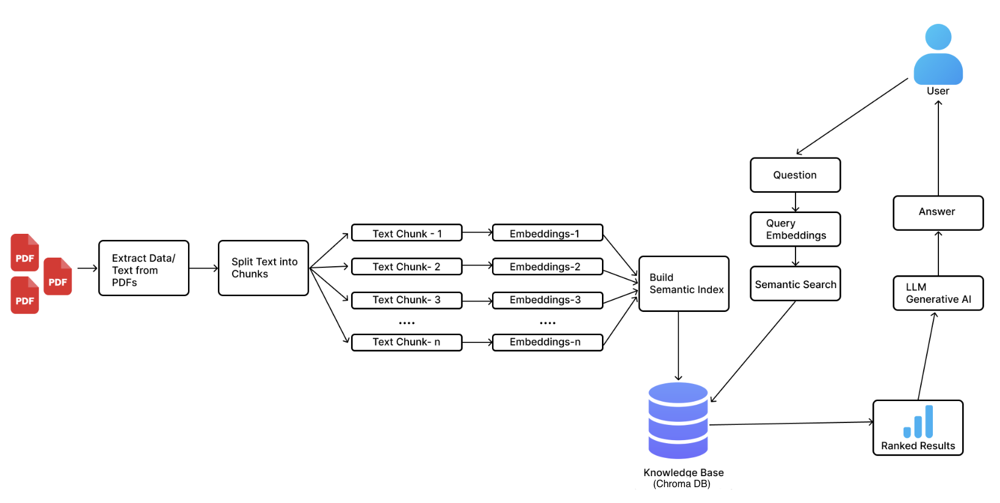

<div align="center">
       
      <h1>RagDoc: A Llama3.1 & RAG Based Chatbot for PDFs</h1>

  
  
  
  <!--  -->
  <!--  -->
  
  </p>
</div>


By ```Kabir Kumar``` | ```ee3210741@iitd.ac.in``` | ```2021EE30741``` | ```IIT Delhi```  
For **Apport AI Engineer Shortlisting Project**


# Project Overview

This project is a RAG (Retrieval-Augmented Generation) chatbot that uses a combination of document embeddings and a language model to answer questions based on the provided context i.e. PDFs. The chatbot is built using Streamlit for the frontend and Chroma for vector storage.

# Architecture


  
<br>

# Setup Instructions

## 1. Download Ollama

First, download and install Ollama from the official website: [Ollama](https://ollama.com/)

## 2. Download Models

Open your terminal and download the required models:

```sh
ollama pull llama3.1b
ollama pull nomic-embed-text
```

## 3. Keep Ollama Running
Ensure that Ollama is running in your terminal:

```sh
ollama serve
```

## 4. Install Conda (if you don't have it)
If you don't have Conda installed, download and install it from the official website: [Conda](https://docs.conda.io/projects/conda/en/latest/user-guide/install/index.html)

## 5. Create Conda Environment
Create a new Conda environment for the project:
```sh
conda create --name rag-chatbot python=3.9
```

## 6. Activate Conda Environment and Install Requirements
Activate the Conda environment and install the required packages:
```sh
conda activate rag-chatbot
pip install -r requirements.txt
```

## 7. Ensure Data Folder is Filled
Make sure the ```data``` folder is filled with the necessary documents. You can place your PDFs in the ```data/private``` and ```data/public``` directories.

## 8. Run the Streamlit App
Finally, run the Streamlit app:

```sh
streamlit run app.py
```

# Usage
Once the app is running, you can interact with the chatbot through the web interface. You can upload PDFs, ask questions, and get responses based on the content of the uploaded documents. HTMLs can also be used by printing the site as a PDF and saving it locally.  
One can do unit testing by running ```pytest -s``` and play around with assert statements.

# Additional Information
For more details on the project structure and code, refer to the source files in the repository.

